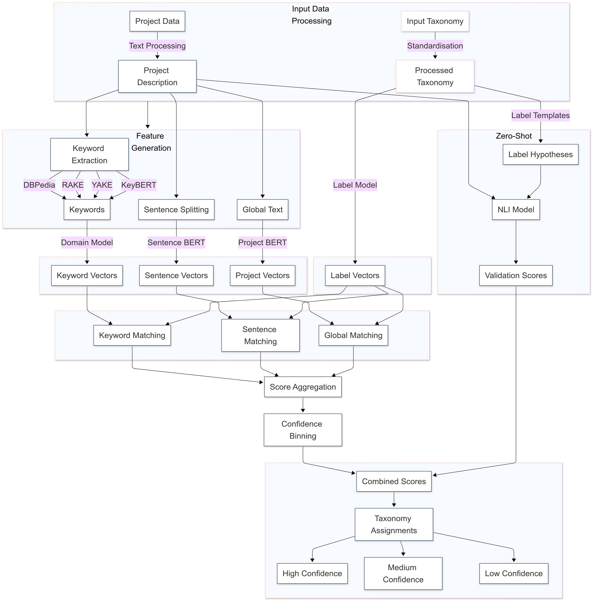

# Research Project Taxonomy Classification

This project helps classify UKRI-funded research projects into standardised taxonomies by linking project descriptions to established research classification systems. It combines semantic similarity analysis with natural language inference to suggest appropriate taxonomy labels and provide confidence scores for these assignments.

<p align="center">
    
</p>

## Methodology

- **Semantic similarity matching**: Uses domain-tuned embeddings to compare project descriptions with taxonomy labels, identifying potential matches through multiple keyword extraction methods.

- **Hierarchical validation**: Ensures consistency across taxonomy levels by validating parent-child relationships and preventing contradictory assignments.

- **Zero-shot classification**: Provides independent verification of matches using natural language inference, helping catch errors that pure similarity matching might miss.

## Outcomes

- **Classified projects dataset**: Links between GtR projects and multiple taxonomies (CWTS, GOScience, OpenAlex), including confidence scores and hierarchical relationships.

- **Maintainable pipeline**: Built with open-source tools and designed for easy adaptation to new taxonomies or classification needs.

- **Validation framework**: Tools for assessing classification quality and tuning parameters, with current validation showing 85% precision on research topic classification.

## Installation

1. **Clone the repository**:
   ```bash
   git clone https://github.com/[organisation]/dsit-taxonomy.git
   cd dsit-taxonomy
   ```

2. **Set up Python environment**:
   ```bash
   conda create -n dsit_taxonomy python=3.10
   conda activate dsit_taxonomy
   ```

3. **Install the package**:
   ```bash
   pip install -e .
   pip install -r requirements.txt
   ```

4. **Install NLP dependencies**:
   ```bash
   python -m spacy download en_core_web_sm
   python -c "import nltk; nltk.download('punkt')"
   ```

## Project Structure

The project uses Kedro to organize its pipelines:

- **Configuration directory (`conf/`)**:
  - Parameters for similarity thresholds and confidence binning
  - Logging configuration
  - AWS credentials for data access

- **Source code directory (`src/`)**:
  - Core taxonomy processing modules
  - Classification pipelines
  - Validation and tuning tools

## Purpose

This project aims to help DSIT better understand their research portfolio by:
1. Suggesting relevant taxonomy labels for research projects
2. Maintaining consistency across hierarchical classifications
3. Providing confidence scores to highlight uncertain assignments

Currently handles three taxonomies:
- **CWTS Topics**: Research fields from OpenAlex (4,516 topics, 252 fields)
- **GOScience Technologies**: DSIT's emerging technology classification
- **OpenAlex Concepts**: Academic concepts with hierarchical relationships

## How It Works

### 1. Finding Similar Concepts
- Converts project descriptions and taxonomy labels into embeddings
- Uses multiple keyword extraction methods to catch different aspects
- Compares embeddings to find matching concepts
- Aggregates evidence from different matching approaches

### 2. Processing Matches
- Combines evidence from sentence-level and global matches
- Applies confidence thresholds based on score distributions
- Handles hierarchical relationships between labels
- Filters out weak or inconsistent matches

### 3. Confidence Scoring
- Assigns confidence levels (high/medium/low)
- Uses both global and project-specific thresholds
- Considers relative strength of matches within projects
- Helps identify uncertain classifications

## Current Performance

Tested against AI expert-labelled samples (300 projects), comparing multiple confidence scoring approaches:

### CWTS Research Topics
| Method            | Precision | Recall | F1    |
|------------------|-----------|--------|-------|
| Conservative     | 0.765     | 0.691  | 0.726 |
| Zero-shot        | 0.784     | 0.661  | 0.717 |
| Maximum          | 0.645     | 0.747  | 0.692 |

### GOScience Technologies
| Method            | Precision | Recall | F1    |
|------------------|-----------|--------|-------|
| Zero-shot        | 0.646     | 0.664  | 0.655 |
| Conservative     | 0.580     | 0.678  | 0.625 |
| Maximum          | 0.350     | 0.760  | 0.479 |

Note: These metrics show the best performing configuration for each approach. Your results may vary depending on the projects and taxonomies used.

## Getting Started

### Setting Up
```bash
# Get the code
git clone https://github.com/[organisation]/dsit-taxonomy.git
cd dsit-taxonomy
pip install -e .

# Install required packages
pip install -r requirements.txt
python -m spacy download en_core_web_sm
python -c "import nltk; nltk.download('punkt')"
```

## Running the Pipeline

The classification process involves several sequential pipelines:

### 1. Data Processing
```bash
# Process taxonomies into standard format
kedro run --pipeline data_processing_taxonomies

# Extract keywords from project descriptions
kedro run --pipeline data_annotation_gtr

# Generate embeddings for keywords
kedro run --pipeline keyword_processing_gtr
```

### 2. Similarity Matching
```bash
# Compute similarity scores
kedro run --pipeline project_similarity_matching

# Process scores into final assignments
kedro run --pipeline project_similarity_refinement
```

### 3. Optional Validation
```bash
# Only if you want to tune parameters or validate results
kedro run --pipeline project_similarity_tune_and_validate
```

Note: Pipelines must be run in order as each depends on the outputs of previous steps.

## What You'll Need

### Essential Requirements
1. **Project Data**:
   - Project descriptions in English
   - Minimum recommended length: 100 words
   - Structured format (title, abstract, technical details)

2. **Taxonomy Structure**:
   - Hierarchical relationships defined
   - Unique identifiers for each label
   - Clear parent-child connections
   - Label descriptions or definitions

3. **AWS Credentials**:
   - Only needed if running on new projects in the future
   - Current validated datasets available publicly
   - Contact DSIT for access details if needed

### Adding New Taxonomies

To add a new taxonomy, you'll need to:

1. **Create Data Processing Node**:

   - Add transformation logic in `src/dsit_taxonomy/pipelines/data_processing_taxonomies/nodes.py`
   - Follow existing examples (e.g., `process_cwts_taxonomy`)
   - Ensure output matches required structure:
      ```python
      # Required final structure
      taxonomy_db = {
         'taxonomy_label_id': str,      # Unique identifier
         'label': str,                  # Label name
         'description': str,            # Label description
         'parent_id': str,              # Parent label ID
         'level': int,                  # Hierarchy level
         'concatenated_label': str      # Full path (e.g., "Physics > Quantum > Optics")
      }
      ```

2. **Update Pipeline**:
   - Modify `data_processing_taxonomies/pipeline.py`
   - Add new processing node to pipeline
   - Define input/output datasets in catalog


### Optional Components
- GPU for processing >10,000 projects
- OpenAI API key (only for additional validation)
- Custom embedding models (if needed)

## Known Limitations

### Data Quality Matters
- Works best with detailed project descriptions
- Needs well-structured taxonomies
- English text only (for now)

### Resource Requirements
- Needs about 2GB RAM per 1,000 projects
- GPU helps with large datasets (>10,000 projects)
- Each taxonomy needs roughly 500MB storage

### Classification Challenges
- Shorter descriptions may get fewer matches
- Very specific or very broad labels can be tricky
- Interdisciplinary projects might get split across topics

## Contributing

We welcome contributions! Please follow these steps:

1. Fork the repository
2. Create a feature branch
3. Make your changes
4. Run tests: `pytest tests/`
5. Submit a pull request